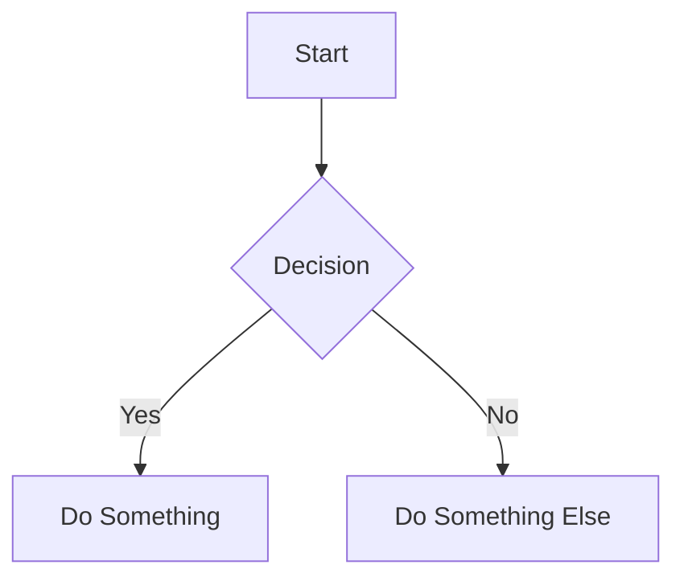

<p align="center">
  <h1 align="center">📄 DocShowcase</h1>
  <p align="center">
    <strong>Create, preview, and share Markdown or HTML documents instantly.</strong><br/>
    No account required. Write, save, get a link, share.
  </p>
</p>

<p align="center">
  <a href="#features">Features</a> •
  <a href="#tech-stack">Tech Stack</a> •
  <a href="#getting-started">Getting Started</a> •
  <a href="#usage">Usage</a> •
  <a href="#url-parameters">URL Parameters</a> •
  <a href="#project-structure">Project Structure</a> •
  <a href="#deployment">Deployment</a> •
  <a href="#license">License</a>
</p>

---

## Features

### ✍️ Editor

- **Markdown Editor** — Full GitHub-Flavored Markdown (GFM) with live side-by-side preview on desktop and tabbed interface on mobile
- **HTML Editor** — Write raw HTML rendered in a sandboxed preview with extensive permission support
- **Resizable Panels** — Drag the divider between editor and preview to your preferred split (15%–85%)
- **Scroll Sync** — Editor and preview scroll positions stay in sync
- **Draft Recovery** — Unsaved work is automatically saved to `localStorage` every 500ms and restored on return

### 🧮 Rich Content Support

- **LaTeX Math** — Inline `$...$` and display `$$...$$` equations powered by [KaTeX](https://katex.org/)
- **Mermaid Diagrams** — Write flowcharts, sequence diagrams, and more inside ` ```mermaid ` code blocks
- **Syntax Highlighting** — Automatic language detection and beautiful code coloring for 180+ languages
- **GitHub Alerts** — `[!NOTE]`, `[!TIP]`, `[!IMPORTANT]`, `[!WARNING]`, `[!CAUTION]` callout blocks
- **Emoji** — Use `:emoji_name:` shortcodes (e.g., `:rocket:` → 🚀)
- **Tables, Task Lists, Footnotes** — All standard GFM extensions

### 🔗 Sharing & Viewing

- **Instant Sharing** — Save your document and get a clean, shareable URL
- **Multiple Display Modes** — View documents in compact, extended, or normal UI mode via URL parameters
- **Heading Anchors** — Every heading gets an auto-generated ID for direct linking (`#section-name`)
- **Smooth Scrolling** — Internal anchor links scroll smoothly to their target

### 🔒 Security

- **Passkey Protection** — Optionally protect documents with a passkey (SHA-256 hashed, never stored in plain text)
- **Edit via `/edit/` route** — Editing is done on a separate URL that requires passkey verification
- **Read-Only by Default** — Documents without a passkey are permanently read-only
- **Sandboxed HTML** — HTML previews run in sandboxed iframes for security

### 🎨 Design

- **Dark / Light / System Themes** — Seamless theme switching with full design system support
- **Theme-Aware Diagrams** — Mermaid flowcharts and code blocks adapt their colors to match the current theme
- **Modern UI** — Built with Radix primitives, Lucide icons, and custom animations
- **Responsive** — Works beautifully on desktop, tablet, and mobile

---

## Tech Stack

| Layer          | Technology                                                                              |
| -------------- | --------------------------------------------------------------------------------------- |
| **Framework**  | [Next.js 16](https://nextjs.org/) with [Turbopack](https://turbo.build/pack)            |
| **Language**   | [TypeScript 5](https://www.typescriptlang.org/)                                         |
| **UI**         | [React 19](https://react.dev/), [Radix UI](https://www.radix-ui.com/), [Lucide](https://lucide.dev/) |
| **Styling**    | [Tailwind CSS v4](https://tailwindcss.com/)                                             |
| **Markdown**   | [react-markdown](https://github.com/remarkjs/react-markdown) + remark/rehype plugins   |
| **Math**       | [KaTeX](https://katex.org/) via rehype-katex                                            |
| **Diagrams**   | [Mermaid](https://mermaid.js.org/)                                                      |
| **Database**   | [Firebase Firestore](https://firebase.google.com/docs/firestore)                        |
| **Theming**    | [next-themes](https://github.com/pacocoursey/next-themes)                               |
| **Fonts**      | [Inter](https://fonts.google.com/specimen/Inter) + [JetBrains Mono](https://fonts.google.com/specimen/JetBrains+Mono) |

---

## Getting Started

### Prerequisites

- [Node.js](https://nodejs.org/) 18.17 or later
- A [Firebase](https://firebase.google.com/) project with Firestore enabled

### 1. Clone the Repository

```bash
git clone https://github.com/your-username/docshowcase.git
cd docshowcase
```

### 2. Install Dependencies

```bash
npm install
```

### 3. Configure Environment Variables

Copy the example environment file and fill in your Firebase credentials:

```bash
cp .env.example .env.local
```

Edit `.env.local` with your Firebase project details:

```env
NEXT_PUBLIC_FIREBASE_API_KEY=your-api-key
NEXT_PUBLIC_FIREBASE_AUTH_DOMAIN=your-project.firebaseapp.com
NEXT_PUBLIC_FIREBASE_PROJECT_ID=your-project-id
NEXT_PUBLIC_FIREBASE_STORAGE_BUCKET=your-project.appspot.com
NEXT_PUBLIC_FIREBASE_MESSAGING_SENDER_ID=your-sender-id
NEXT_PUBLIC_FIREBASE_APP_ID=your-app-id

# Secure Server-Side Firebase Editor Credentials
FIREBASE_EDITOR_EMAIL="editor@yourdomain.com"
FIREBASE_EDITOR_PASSWORD="your_secure_password"
```

> **Where to find these?** Go to your [Firebase Console](https://console.firebase.google.com/) → Project Settings → General → Your Apps → Web App → Config.
> 
> **For Editor Credentials:** Go to **Authentication** in Firebase, create an Email/Password user, and put those exact credentials in the server `.env.local` to secure database writes.

### 4. Set Up Firestore

1. In the Firebase Console, go to **Firestore Database**
2. Click **Create database**
3. Choose **Start in production mode** (or test mode for development)
4. Select a location closest to your users

No additional collections or indexes need to be created manually — the app creates the `documents` collection automatically.

### 5. Start the Development Server

```bash
npm run dev
```

Open [http://localhost:3000](http://localhost:3000) in your browser.

---

## Usage

### Creating a Document

1. Visit the homepage and click **"Start Creating"** or go directly to `/editor`
2. Choose **Markdown** or **HTML** from the type selector in the toolbar
3. Give your document a name (optional — a random ID is generated if left blank)
4. Write your content in the editor. The preview updates in real-time
5. Optionally set a **passkey** to allow future editing
6. Click **"Save & Share"**

### Sharing a Document

After saving, you'll be redirected to the share page with your document's public URL. From there you can:

- **Copy URL** — Copies the link to your clipboard
- **Share** — Opens the native share dialog (on supported devices)
- **Open** — Opens the document in a new tab

The public view URL follows the format:
```
https://your-domain.com/view/your-document-name
```

### Editing a Document

If you set a passkey when creating the document:

1. Navigate to `/edit/your-document-id` (or click the **Edit** button on the Markdown view page)
2. Enter your passkey when prompted
3. Make your changes and click **"Update"**

> Documents without a passkey are permanently read-only and cannot be edited.

### Writing Markdown

DocShowcase supports full **GitHub-Flavored Markdown** plus extensions:

#### Math (LaTeX)

```markdown
Inline math: $E = mc^2$

Display math:
$$
\sum_{i=1}^{n} i = \frac{n(n+1)}{2}
$$
```

#### Mermaid Diagrams

````markdown

````

#### GitHub Alerts

```markdown
> [!NOTE]
> This is a helpful note.

> [!WARNING]
> Be careful with this operation.
```

#### Emoji

```markdown
:rocket: :tada: :thumbsup:
```

---

## URL Parameters

When viewing a document at `/view/{id}`, you can customize the display using query parameters:

| Parameter   | Value      | Behavior                                                                                    |
| ----------- | ---------- | ------------------------------------------------------------------------------------------- |
| *(none)*    | —          | **Default.** Renders with full app UI (header, footer, title, edit button)                  |
| `display`   | `compact`  | Hides app UI. Shows only the Markdown content in a centered, readable-width layout          |
| `display`   | `extended` | Hides app UI. Shows Markdown content stretched to the full width of the screen              |

### Examples

```
/view/my-document                    → Normal view with full app UI
/view/my-document?display=compact    → Clean, centered content only
/view/my-document?display=extended   → Full-width content only
```

> **HTML documents** always render in full-screen mode (no app UI) by default. Use `?display=compact` to embed them within the app layout.

---

## Project Structure

```
docshowcase/
├── src/
│   ├── app/
│   │   ├── layout.tsx              # Root layout (fonts, theme, header, footer)
│   │   ├── page.tsx                # Landing page with hero & feature cards
│   │   ├── globals.css             # Design system (CSS variables, typography)
│   │   ├── not-found.tsx           # Custom 404 page
│   │   ├── editor/
│   │   │   └── page.tsx            # New document editor
│   │   ├── edit/
│   │   │   └── [id]/
│   │   │       ├── page.tsx        # Edit page (server: fetch doc, check passkey)
│   │   │       └── edit-client.tsx  # Passkey gate → editor
│   │   ├── view/
│   │   │   └── [id]/
│   │   │       ├── page.tsx        # View page (server: fetch doc, metadata)
│   │   │       └── view-client.tsx  # Display mode handling, markdown/HTML render
│   │   ├── share/
│   │   │   └── [id]/
│   │   │       ├── page.tsx        # Share success page (server)
│   │   │       └── share-client.tsx # Copy/share/open buttons
│   │   └── api/
│   │       └── verify-passkey/
│   │           └── route.ts        # POST: verify passkey hash
│   ├── components/
│   │   ├── editor-view.tsx         # Main editor component (toolbar, panels)
│   │   ├── preview-pane.tsx        # Markdown/HTML renderer
│   │   ├── code-block.tsx          # Styled code block with copy button
│   │   ├── mermaid-block.tsx       # Theme-aware Mermaid diagram renderer
│   │   ├── header.tsx              # App header with logo & theme toggle
│   │   ├── footer.tsx              # App footer
│   │   ├── theme-provider.tsx      # next-themes wrapper
│   │   ├── theme-toggle.tsx        # Light/dark/system toggle
│   │   └── ui/                     # Reusable UI primitives (Radix-based)
│   └── lib/
│       ├── actions.ts              # Server actions (save, update, get document)
│       ├── firebase.ts             # Firebase initialization
│       ├── crypto.ts               # SHA-256 passkey hashing & verification
│       ├── types.ts                # TypeScript types & interfaces
│       └── utils.ts                # Utility functions
├── .env.example                    # Environment variable template
├── apphosting.yaml                 # Firebase App Hosting config
├── next.config.ts                  # Next.js configuration
├── tailwind.config.ts              # Tailwind CSS configuration (if present)
├── tsconfig.json                   # TypeScript configuration
└── package.json                    # Dependencies & scripts
```

---

## Available Scripts

| Command         | Description                          |
| --------------- | ------------------------------------ |
| `npm run dev`   | Start dev server with Turbopack      |
| `npm run build` | Build for production                 |
| `npm start`     | Start production server              |
| `npm run lint`  | Run ESLint                           |

---

## Deployment

### Firebase App Hosting

This project includes an `apphosting.yaml` for [Firebase App Hosting](https://firebase.google.com/docs/app-hosting):

```bash
firebase apphosting:backends:create
```

### Vercel

Deploy with one click using [Vercel](https://vercel.com/):

1. Push your code to GitHub
2. Import the repository in Vercel
3. Add the environment variables in the Vercel dashboard
4. Deploy

### Other Platforms

Any platform that supports Next.js can host DocShowcase. Make sure to:

1. Set all `NEXT_PUBLIC_FIREBASE_*` environment variables
2. Run `npm run build` to generate the production bundle
3. Start the server with `npm start`

---

## Firestore Security Rules

To ensure maximum security in production, all write operations are routed securely through the Next.js server, which uses the dedicated `FIREBASE_EDITOR` credentials to authenticate.

Add these Firestore security rules in your Firebase Console to protect your data. Replace the `request.auth.uid` with the specific User UID of your editor account for the ultimate lockdown.

```javascript
rules_version = '2';
service cloud.firestore {
  match /databases/{database}/documents {
    match /{document=**} {
      // Anyone can read documents openly
      allow read: if true;
      
      // ONLY the explicitly configured editor user can write, update, or delete.
      // Replace the UID below with the User UID of your configured editor account.
      allow write: if request.auth != null && request.auth.uid == 'YOUR_SPECIFIC_USER_UID';
    }
  }
}
```

> **Security Note:** Because the Next.js server authenticates itself with your editor credentials, client-side writes are strictly blocked by these rules. Even if someone finds your Firebase project config, they cannot alter your database without the server's `.env` credentials.

---

## Content Limits

| Limit               | Value    |
| -------------------- | -------- |
| Max document size    | **1 MB** |
| Document ID format   | Slug from name, or random 8-char alphanumeric |
| Passkey storage      | SHA-256 hash (never stored in plain text) |

---

## Contributing

Contributions are welcome! Please feel free to submit a Pull Request.

1. Fork the repository
2. Create your feature branch (`git checkout -b feature/amazing-feature`)
3. Commit your changes (`git commit -m 'Add amazing feature'`)
4. Push to the branch (`git push origin feature/amazing-feature`)
5. Open a Pull Request

---

## License

This project is open source. Feel free to use it for your own projects.

---

<p align="center">
  Built with ❤️ by <strong>AryansDevStudios</strong>
</p>
